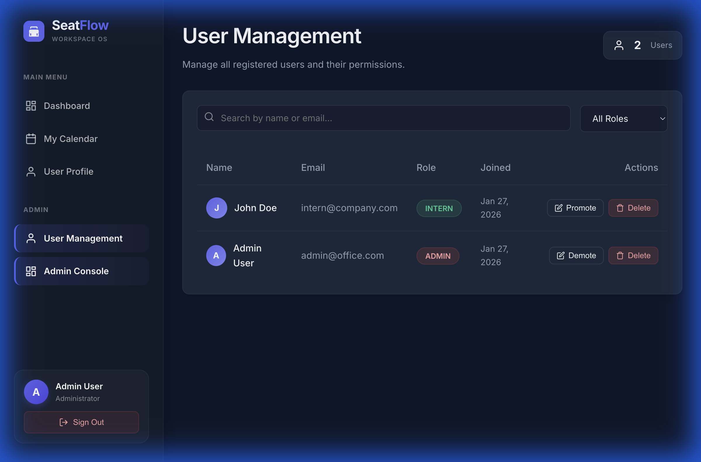
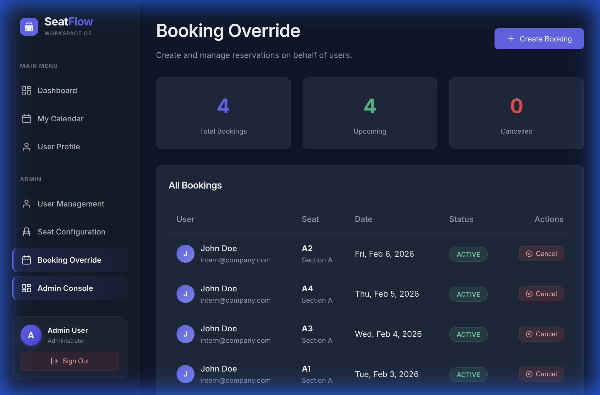
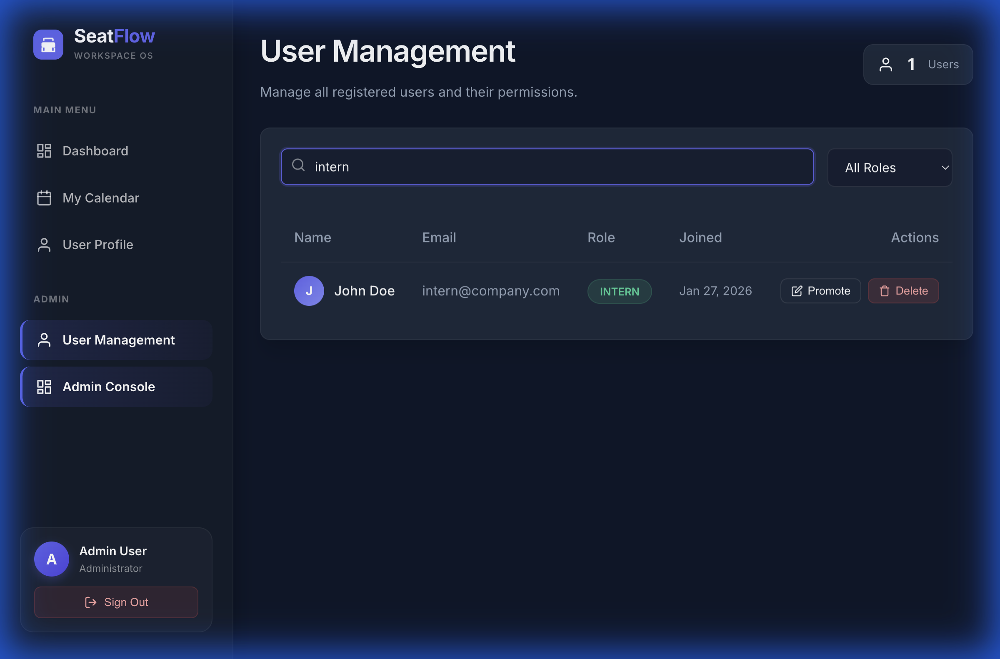

# Bus Seat Booking System

A full-stack Seat Booking application allowing users to reserve seats, and administrators to manage the inventory and users.

## 🚀 Features

### Public/User Features
*   **Authentication**: Secure login and registration.
*   **Seat Selection**: Visual representation of seat availability.
*   **Booking System**: Users can book available seats.
*   **User Dashboard**: Users can view their upcoming and past reservations.

### Admin Panel
*   **User Management**: View, search, filter, and manage user roles (Admin/User).
*   **Booking Override**: Admins can create reservations on behalf of others.
*   **Seat Configuration**: Inventory dashboard showing total, available, and booked seats.

---

## 🛠 Tech Stack (Current)
*   **Framework**: Next.js / React
*   **Database ORM**: Prisma
*   **Authentication**: JWT & bcryptjs
*   **Styling**: CSS & UI Components

---

## 🔮 Future Updates & Professional Roadmap

As this project scales, the following "Pro-Level" updates are planned to improve performance, data integrity, and user experience:

### 1. Database & Integrity (The Foundation)
*   **Preventing Double Bookings**: Implement strict **Compound Unique Indexes** in the database. This ensures that even if two users click "Book" at the exact same millisecond on the same seat, the database engine will permanently reject the conflict.
*   **Pagination & Indexing**: Fetching large lists of users/seats will be paginated to save bandwidth and ensure instant load times even with 100,000+ users.

### 2. UI/UX Polish (The Professional Feel)
*   **Skeleton Loaders**: Replace static "Loading..." text with animated, shimmering gray shapes (like LinkedIn or YouTube) while data fetches.
*   **Smooth Layout Animations**: Integrate `framer-motion` so that when filtering users or searching for a seat, the elements smoothly shuffle into their new positions rather than instantly snapping.

### 3. Backend Robustness (The Safety Net)
*   **Advanced Schema Validation (Joi/Zod)**: Implement professional validation middleware to strictly enforce data rules (e.g., verifying email formats and date logic) *before* the request reaches the controller logic.
*   **Centralized Error Handling**: Implement a global error-catching boundary to ensure any server or database failure returns a consistently formatted, secure JSON response without crashing the app.
